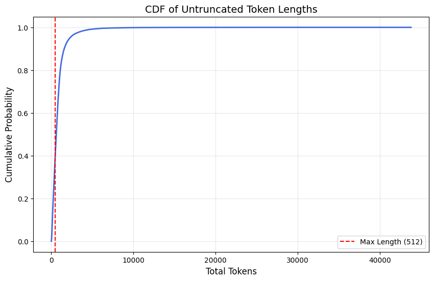

# LLM Classification Finetuning
This project implements a solution to the LLM classification finetuning competition on [Kaggle](https://www.kaggle.com/competitions/llm-classification-finetuning).

## Background

The standard process in training LLMs is first pre-training followed by post-training. Pre-training feeds a large amount of text data to a transformer model to create a model that possesses a high degree of semantic understanding. At this point the model can generate text, but may not be suitable for conversations with humans yet as it may not understand the typical structure of conversations / Q&A's or be aligned to what is safe / suitable for human conversations. This is where post-training is used to align pretrained models to desired goals. Specifically, it uses reinforcement learning human-feedback (RLHF) to reward model responses that align with user preferences. User preference is typically represented as labeled data used in supervised learning by having a human choose between two LLM responses for their prompt. This is the task of this Kaggle competition: to train a model to predict user preference of LLM generated responses.

## Models

### Model #1: Basic Pretrained Text Model Classification

The first step to using an LLM is encoding the text for input to the model. We use learned embeddings to encode text as tokens. Tokens can be a single or several words, and even contain partial words. Tokens represent the text as a vector in a lower-dimensional vector space. This encoded vector is what's actually passed to the model as the input tensor, so we input a sequence of tokens rather than a sequence of words. Learned embeddings allow us to train a model that learns what the mapping from text to token vectors should be. In this model we use the pretrained model [Bert tiny](https://huggingface.co/prajjwal1/bert-tiny) for the embedding.

After tokenization, the LLM uses a transformer architecture to generate the output. What makes the transformer useful is the self-attention mechanism that allows the model to weigh the importance of different tokens in a sequence relative to each other, enabling it to understand context. Again, we use [Bert tiny](https://huggingface.co/prajjwal1/bert-tiny) as our base pretrained model. It is helpful to start any LLM task with a pretrained model as it has already been fed tons of text data and possesses significant semantic understanding. We will build upon this model by fine-tuning it for our specific task and dataset.

Our task is to classify user preference of LLM generated responses. Specifically, we're given a prompt and two responses, and our goal is to output a probability vector over which response the user prefers: response A, response B, or a tie. This means our output vector should be length 3, so we attach a classification head to the output of the pretrained model. For this we use a linear layer that converts from the output size to length 3. We also add a dropout layer before the linear layer to add regularization to prevent overfitting. Dropout randomly disables a fraction of neurons during training (we use a standard rate of 0.3). The full architecture is shown below:

```python
class LlmPreferenceModel(nn.Module):
    def __init__(self, model_name=MODEL_PATH, num_classes=3):
        super(LlmPreferenceModel, self).__init__()
        self.transformer = AutoModel.from_pretrained(model_name, local_files_only=True)
        hidden_size = self.transformer.config.hidden_size

        # Classification head
        # Dropout layer for regularization to prevent overfitting
        self.dropout = nn.Dropout(0.3) 
        self.classifier = nn.Linear(hidden_size, num_classes)

    def forward(self, input_ids, attention_mask):
        outputs = self.transformer(input_ids=input_ids, attention_mask=attention_mask)
        last_hidden_state = outputs.last_hidden_state
        cls_output = last_hidden_state[:, 0, :]

        # Apply dropout and linear layer
        pooled_output = self.dropout(cls_output)
        logits = self.classifier(pooled_output)
        
        return logits
```

The network uses cross entropy loss, the AdamW optimizer, and the learning rate scheduler ReduceLROnPlateau.

#### Context Window

In tokenization we construct our model input by appending the prompt and two responses with special characters seperating them. An example of what this looks like is: \<s> Prompt \</s> RespA \</s> RespB \</s>. The challenge is LLMs have a context window, which is the maximum size of the input prompt / tensor. Our pretrained model has a context window of 512 tokens, which covers the prompt and both responses. Plotting a CDF of input token lengths we observe that only 41.37% of samples fit within the 512 token limit, and that some samples can have more than 40,000 tokens.



We have a problem! Most of our samples won't fit into the model's context window. The naive solution is to simply truncate the input tensor, but the problem with this is that since we construct our input as Prompt + RespA + RespB this means we could potentially cut off the second response completely. We should be more fair when allocating tokens between the three components. To address this we borrow a scheme from networking called [max-min fairness](https://en.wikipedia.org/wiki/Max-min_fairness). The idea is that each component equally splits the available capacity up until their requested amount, so that everyone either gets what they requested or equally shares the limited capacity. With this strategy we may still truncate and cut off a lot of important context, but at least now it's equally shared by the prompt and two responses. The specific algorithm is shown below:

```python
def max_min_fair_truncation(tok_p, tok_a, tok_b, max_length):
    """
    Distributes capacity fairly among prompt and two responses.
    Uses max-min fairness: satisfy shortest sequence first.
    """
    toks = [('p', tok_p), ('a', tok_a), ('b', tok_b)]
    # Sort by length ascending to satisfy shortest first
    toks.sort(key=lambda x: len(x[1]))
    
    # RoBERTa uses <s> Prompt </s> RespA </s> RespB </s>
    # That is 1 CLS and 3 SEP tokens = 4 special tokens total
    capacity = max_length - 4
    remaining_items = len(toks)
    
    results = {}
    for tid, tok in toks:
        # Fair share is the remaining capacity divided by remaining items
        fair_share = capacity // remaining_items
        alloc = min(len(tok), fair_share)
        
        results[tid] = tok[:alloc]
        capacity -= len(results[tid])
        remaining_items -= 1
        
    return results['p'], results['a'], results['b']
```

This model scores 1.08393 on the leaderboard dataset ([source](https://www.kaggle.com/code/kamerondawson/llm-classification-finetuning?scriptVersionId=298775103)). The score is based on the log loss between the predicted probabilities and the ground truth values (lower score is better). For reference, the leaderboard ranges from ~0.8 to ~2.0, so this score puts us around the middle.

### Model #2: Truncation

Input truncation is a huge challenge for this problem as a lot of important context is lost. Right now the solution to this is max-min fair truncation with capacity allocated to the head of each component. An idea to improve this is to split the allocated capacity between head and tail, so that different context for each response is included. The algorithm is shown below:

```python
def max_min_fair_head_tail_truncation(tok_p, tok_a, tok_b, max_length):
    """
    Uses max-min fairness but splits between head and tail of response rather than just the head.
    """
    toks = [('p', tok_p), ('a', tok_a), ('b', tok_b)]
    toks.sort(key=lambda x: len(x[1]))
    capacity = max_length - 4
    remaining_items = len(toks)
    results = {}
    for tid, tok in toks:
        fair_share = capacity // remaining_items
        alloc = min(len(tok), fair_share)
        results[tid] = tok[:alloc//2] + tok[-alloc//2:] # Only difference is this
        capacity -= len(results[tid])
        remaining_items -= 1
    return results['p'], results['a'], results['b']
```

This model scored 1.08510 ([source](https://www.kaggle.com/code/kamerondawson/llm-classification-finetuning?scriptVersionId=299373041)), so actually slightly underperformed the head-only truncation.

### Model #3: Positional Bias

In RLHF users are shown RespA and RespB and they have to pick which response they prefer for their prompt. One potential bias is positional bias where users tend to prefer the response in the first position. To remove this bias from our training we duplicate each sample in our train set by swapping each response, so every original sample has two samples in training: (1) prompt + respA + respB (2) prompt + respB + respA. Additionally, during inference we run the model twice, once with the original sample and again with the swapped sample, then average the two probability vectors to get our final prediction.

This model scored 1.07776 ([source](https://www.kaggle.com/code/kamerondawson/llm-classification-finetuning?scriptVersionId=299378051)), so slightly improved our performance.

### Model #4: Larger Pretrained Model

This model switched to a larger pretrained text model: [MS marco](https://huggingface.co/cross-encoder/ms-marco-MiniLM-L6-v2). This performed worse with a score of 1.20250 ([source](https://www.kaggle.com/code/kamerondawson/llm-classification-finetuning?scriptVersionId=299383511)).

### Model #5: Undo Bad Optimizations

Switching back to head truncation on top of the positional bias Bert tiny model improved the score to 1.06595 ([source](https://www.kaggle.com/code/kamerondawson/llm-classification-finetuning?scriptVersionId=300875881)).

### Model #6: Sliding Context Window

The goal is to include the full text in the context window instead of truncating it. One idea is to chunk the prompt, respA, and respB, then run the model over the cartesian product of chunks (i.e. m(p_i, A_j, B_k)), then average the outputs to get the final output. The problem is the cartesian product can be very large. An approximation of this is to use a sliding context window. We calculate the max-min fair allocation to each component and use this as the chunk size, then slide the context window over the chunks at a rate such that each window finishes at the same time. The intuition behind this is that we align the "beginning", "middle", and "end" of each component in our comparison with the assumption being that the position of the prompt is relevant to the position for each response. This reduces the number of model runs from O(N^3) in the cartesian product chunking to O(N) in the sliding context window.

The score for this model is X ([source](https://www.kaggle.com/code/kamerondawson/llm-classification-finetuning?scriptVersionId=300910397)).

### Model #7: Sliding Context Window w/ Global Attention

The sliding context window allows us to use the full context in our model, but it only allows for local reasoning as it only compares local chunks. To improve our model we need to add a sense of "global attention" to allow for cross-chunk reasoning. Right now our model combines the outputs from each chunk comparison for a sample using mean pooling, which weights all outputs equally. We can use a hierarchical architecture adding a network after the sliding window model to learn how to combine the chunk outputs. This helps our model learn the relationships between chunks where the chunk output can be thought of as the "summary" for that chunk.

### Further Ideas

1. Chunk prompt, respA, and respB, then run the model over the cartesian product of chunks (i.e. m(p_i, A_j, B_k)), then average the outputs to get the final output. Problem: cartesian product can be large.
2. Summarize prompt, respA, and respB first (maybe with a sliding context window), then feed them into the model as one context window. Problem: may be hard to summarize really long responses.
3. Use a model to extract the relevant context from each component that fits into the max-min fair capacity of the context window. Problem: better than head-only truncation but still truncation.